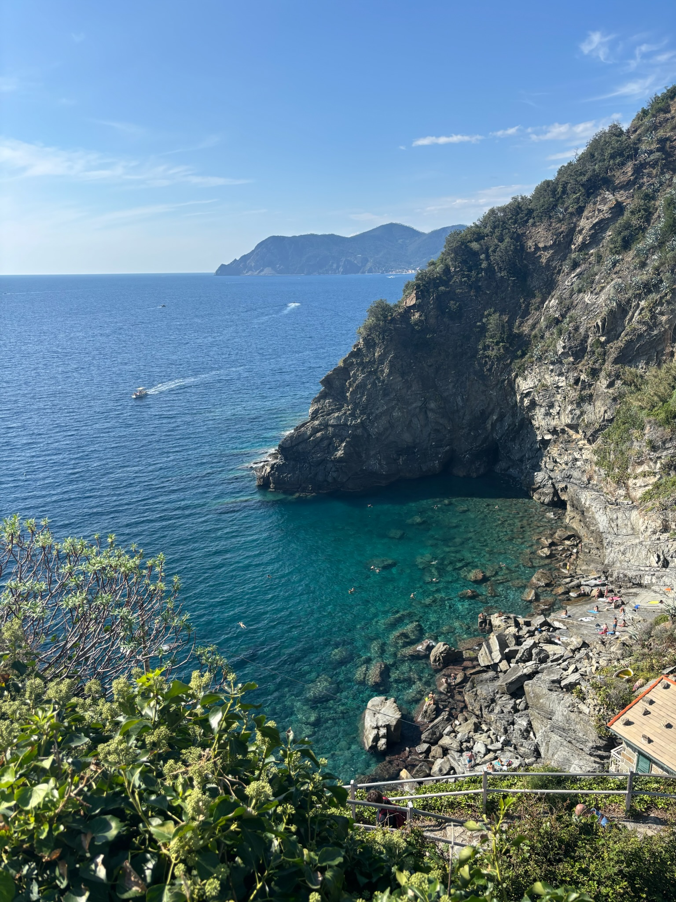
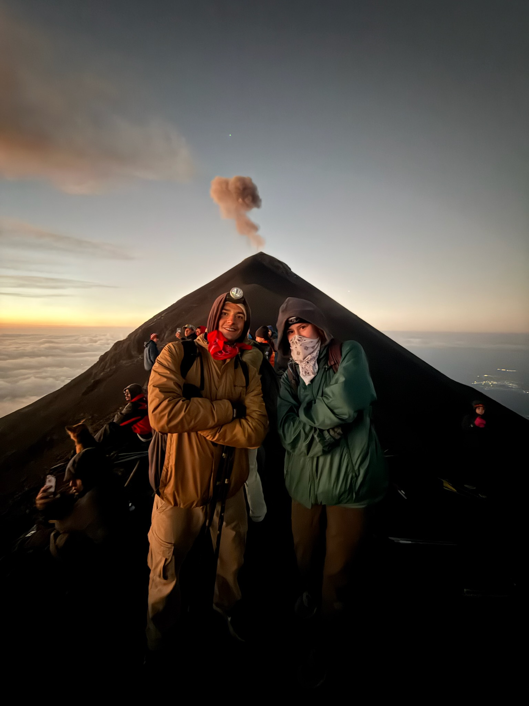
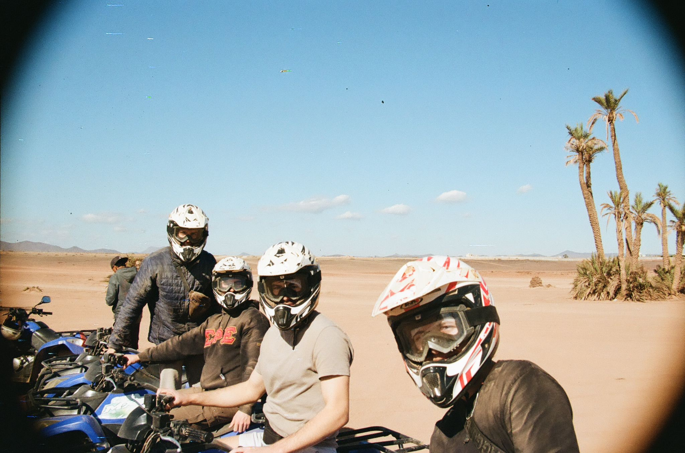
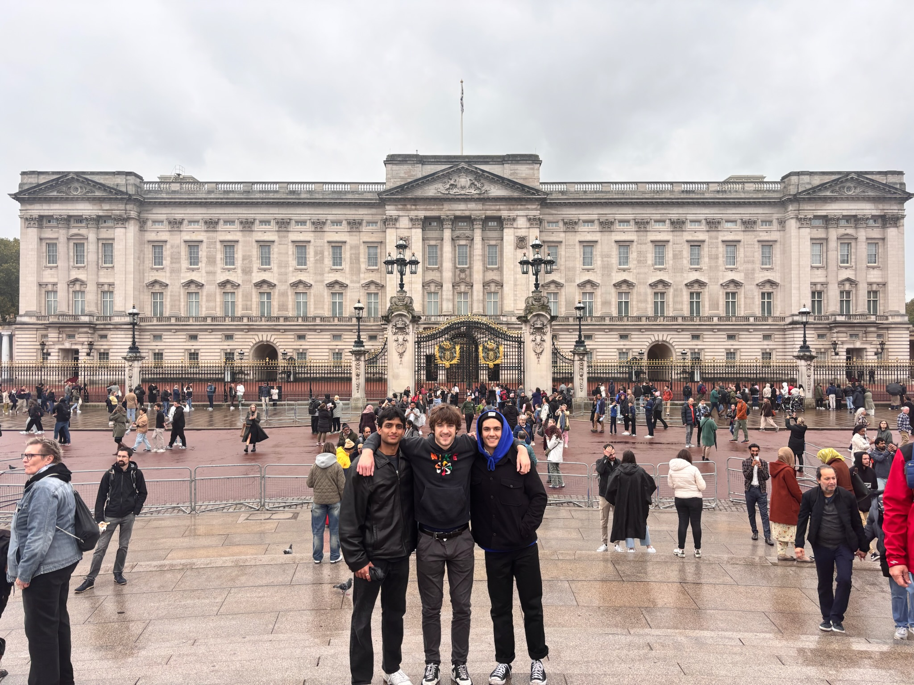

:::{.text-panel}
## Background 

Originating from a Military family, Matthew Schoen spent first half of his childhood in Fairfax County, VA with a brief stint in Okinawa, Japan, before moving to North County San Diego, CA in 2016. 

The transition from playing in the woods after school to walking along the beach jump-started Matthew's love for the natural environment. Compounded by experiences as a Boy Scout and being a PADI certified advanced open water diver, he decided to pursue a degree in Environmental Studies at the University of California, Santa Barbara. 
:::
## Education 


# Education 

# Interests


::: {.text-panel}
## *Travel*

So far, I've been fortunate enough to live in 3 continents - *North America, Europe & Asia* - and travel to 10 countries. 

```{=html}
<div id="photoCarousel" class="carousel slide" data-bs-ride="carousel" data-bs-interval="3000">

  <div class="carousel-inner">

    <div class="carousel-item active">
      
   
   <div class="photo-caption">
   <p>Beaches of Corniglia | Cinque Terre, Italy (October, 2024)</p>
   </div>
   </div>


    <div class="carousel-item">
      
    
    <div class="photo-caption">
   <p>Summit of Volcan de Fuego | Antigua, Guatemala (March, 2026)</p>
   </div>
    </div>

    <div class="carousel-item">
      
    
        <div class="photo-caption">
   <p>ATVs with friends | Marrakech, Morocco (December, 2024)</p>
   </div>
   </div>

<div class="carousel-item">
      
    
        <div class="photo-caption">
   <p>Buckingham Palace with friends | London, England (November, 2024)</p>
   </div>

  </div>

  <button class="carousel-control-prev" type="button" data-bs-target="#photoCarousel" data-bs-slide="prev">
    <span class="carousel-control-prev-icon"></span>
  </button>

  <button class="carousel-control-next" type="button" data-bs-target="#photoCarousel" data-bs-slide="next">
    <span class="carousel-control-next-icon"></span>
  </button>

</div>
```

I believe immersing myself in different cultures, languages, & beliefs is crucial to my understanding of the world. It's incredibly eye-opening as I've come to realize early in my life how much of a privilege it is to call the United States my home. 

However, I plan on working abroad for 1-2 years sometime during my 20s! 

:::

# Hobbies 


