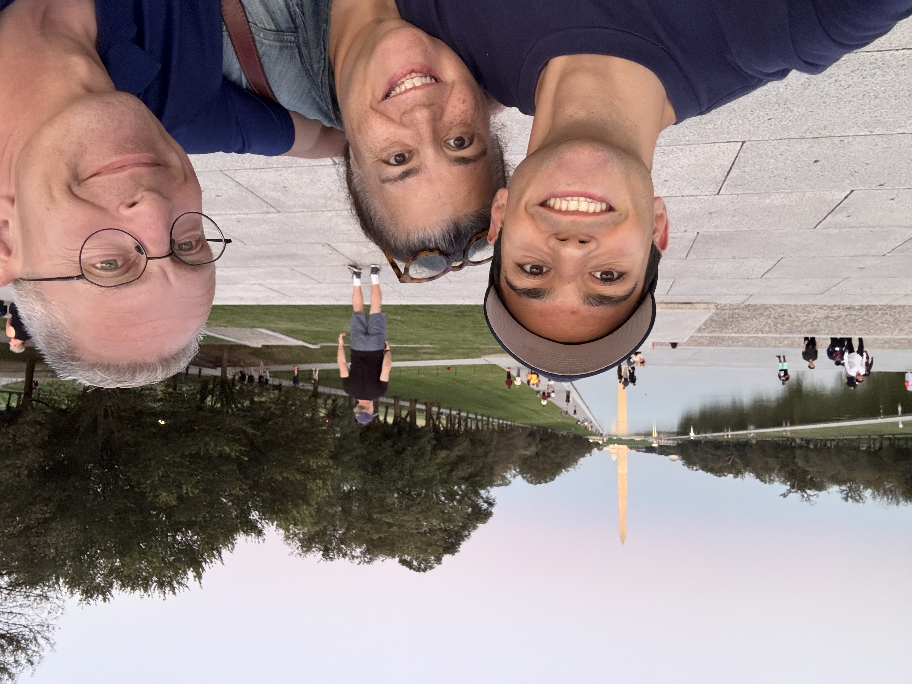
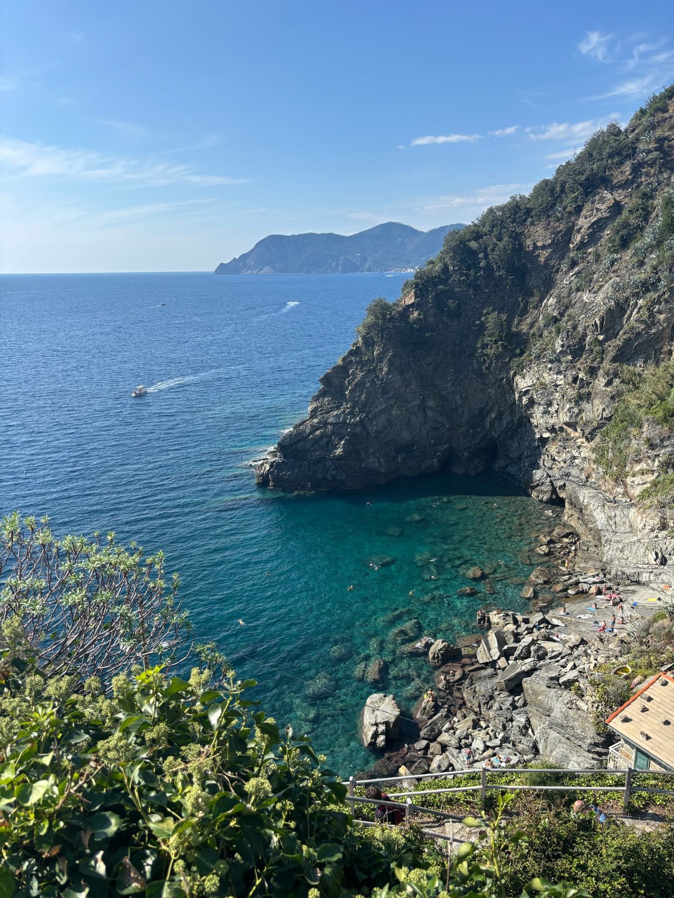
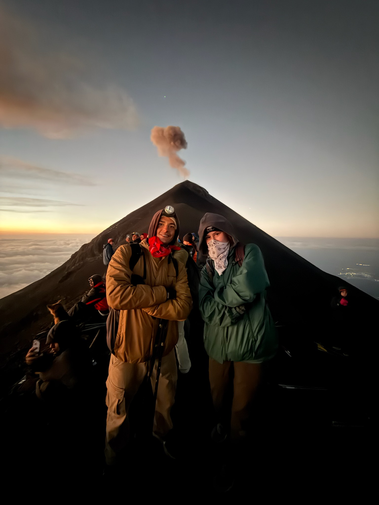
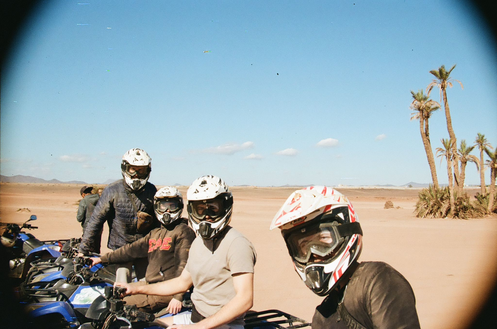
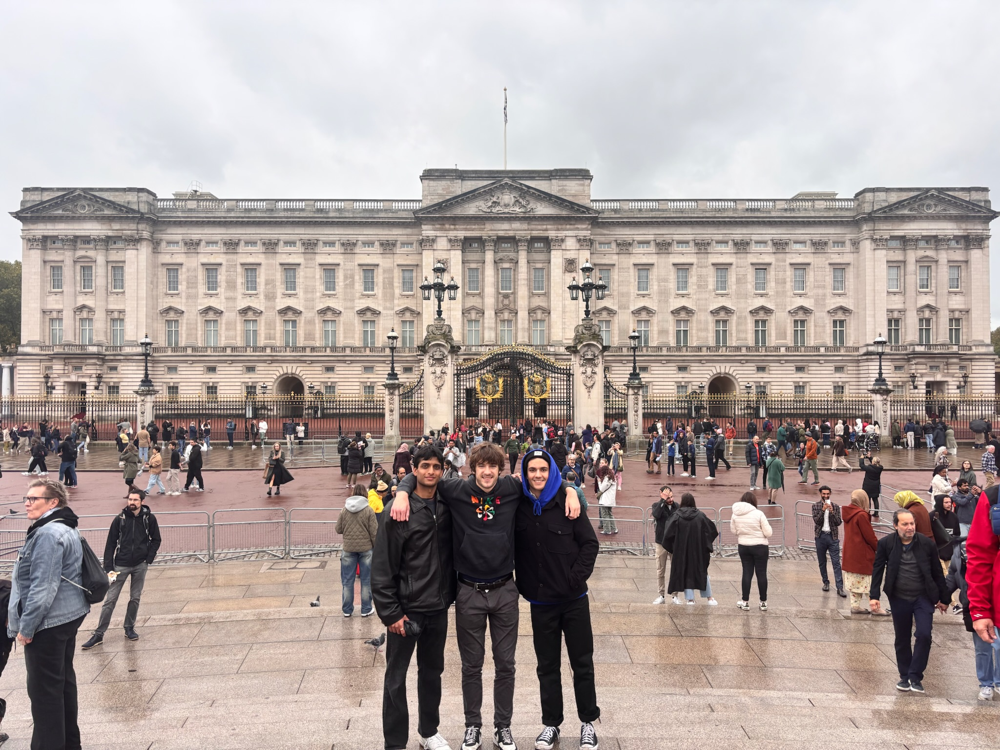
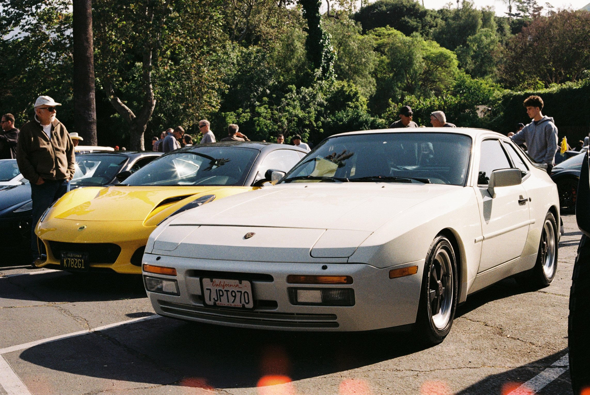

:::{.text-panel}

## Background 

Born into a military family, I spent the first half of my childhood in Fairfax County, Virginia, with a brief stint living in Okinawa, Japan, before moving to North County San Diego in 2016. Growing up, I was fortunate to be influenced by two strong role models: my father, a Captain in the U.S. Navy, and my mother, a nurse. It's through them I learned the importance of hard work, dedication, perseverance, leadership, and service to others - values that continue to guide me today.

{width="75%"}

The transition from exploring the woods of Northern Virginia to spending my days along the Southern California coastline sparked a deep appreciation for the natural environment. Combined with my experiences as a Boy Scout and a PADI Advanced Open Water Diver, this passion ultimately led me to pursue a degree in Environmental Studies at the University of California, Santa Barbara, where I continue to explore solutions to some of today's most pressing environmental challenges.

## Education 

I hold a **B.S. in Environmental Studies** from the University of California, Santa Barbara (UCSB). My emphasis within the major has focused on waste management, infrastructure, & policy - a sector of the sustainability world that is *still* incredibly underdeveloped. 

I spent the Fall 2024 semester studying abroad at the University of Bologna (Unibo) in Bologna, Italy. Being a complete immersion program, I attended classes with Italian students and lived with two Italian roommates who quickly became (and still are) some of my closest friends. I completed master's level coursework through Unibo's Political Science and Environmental Engineering departments. 

My four years at UCSB have been a whirlwind of fun, challenge, and opportunity. I will forever be grateful for the Environmental Studies department professors and faculty for their endless support and mentorship. 

### Organizations & Activities 

#### *UCSB Zero Waste Committee*
##### **Role:** Co-Chair 

#### *A.S. Office of the President*
##### **Role:** Commissioner of Environmental Sustainability 

#### *Gaucho Racing* 
##### **Role:** Logistics Manager, Powertrain 

#### *Sprout Up!* 
##### **Role:** Student Instructor

### Achievements

#### *Environmental Studies Outstanding Senior Award* (2026)

**About:** This is the highest honor awarded by the department each year and recognizes a graduating senior who exemplifies academic excellence, leadership, service, and meaningful contributions to the Environmental Studies Program and broader community. 

#### *UCSB Outstanding Academic Achievement Award* (2026)

**About:** The Outstanding Academic Achievement Award is given to graduating seniors have demonstrated exemplary scholastic performance and have received an overall minimum cumulative GPA of 3.75.

#### *UCSB Service Award* (2026)

**About:** This award recognizes graduating students who have demonstrated a depth of knowledge and contribution in several different areas of campus life. These awards are given in recognition of selfless and dedicated service to the university community.

#### *Junior Individual Co-Curricular Award* (2025) 

**About:** Awarded in recognition of outstanding contributions to the quality of campus life and co-curricular activities through sustained participation and leadership. 

# Interests

## *Travel*

So far, I've been fortunate enough to live in 3 continents - *North America, Europe & Asia* - and travel to 10 countries. 

```{=html}
<div id="photoCarousel" class="carousel slide" data-bs-ride="carousel" data-bs-interval="3000">

  <div class="carousel-inner">

    <div class="carousel-item active">
      
   
   <div class="photo-caption">
   <p>Beaches of Corniglia | Cinque Terre, Italy (October, 2024)</p>
   </div>
   </div>


    <div class="carousel-item">
      
    
    <div class="photo-caption">
   <p>Summit of Volcan de Fuego | Antigua, Guatemala (March, 2026)</p>
   </div>
    </div>

    <div class="carousel-item">
      
    
        <div class="photo-caption">
   <p>ATVs with friends | Marrakech, Morocco (December, 2024)</p>
   </div>
   </div>

<div class="carousel-item">
      
    
        <div class="photo-caption">
   <p>Buckingham Palace with friends | London, England (November, 2024)</p>
   </div>

  </div>

  <button class="carousel-control-prev" type="button" data-bs-target="#photoCarousel" data-bs-slide="prev">
    <span class="carousel-control-prev-icon"></span>
  </button>

  <button class="carousel-control-next" type="button" data-bs-target="#photoCarousel" data-bs-slide="next">
    <span class="carousel-control-next-icon"></span>
  </button>

</div>
```

I believe immersing myself in different cultures, languages, & beliefs is crucial to my understanding of the world. It's incredibly eye-opening as I've come to realize early in my life how much of a privilege it is to call the United States my home. 

However, I plan on working abroad for 1-2 years sometime during my 20s! 

Use the map below to see all the major cities I've traveled to! 

```{r set up}
#| echo: false
#| message: false
library(tidyverse)
library(leaflet)
library(leaflet.extras)
library(here)
library(janitor)

# reading in data ----
travel_map_locations <- read.csv(here("data", "travel_map_locations.csv"))
```

```{r clean data}
#| echo: false
travel_map_clean <- travel_map_locations |> 
  clean_names()
```

```{r}
#| echo: false 
flag_icons <- icons(
  iconUrl = ~case_when(
    country == "USA" ~ "Images/flags/US_flag.png",
    country == "Italy" ~ "Images/flags/Italy_flag.png",
    country == "France" ~ "Images/flags/France_flag.png",
    country == "Germany" ~ "Images/flags/Germany_flag.png",
    country == "United Kingdom" ~ "Images/flags/UK_flag.png",
    country == "Morocco" ~ "Images/flags/Morocco_flag.png",
    country == "Guatemala" ~ "Images/flags/Guatemala_flag.png",
    country == "San Marino" ~ "Images/flags/SanMarino_flag.png",
    country == "Japan" ~ "Images/flags/Japan_flag.png",
    TRUE ~ "Images/flags/default.png"
  ),
  iconWidth = 30,
  iconHeight = 20
)
```

```{r}
#| echo: false
travel_map <- leaflet() %>%
  addProviderTiles(providers$Esri.WorldImagery) %>%
  setView(lng = 0, lat = 30,  zoom = 2) %>%
  addMarkers(data = travel_map_clean,
             lng = ~longitude,
             lat = ~latitude,
             icon = flag_icons,
             popup = ~paste0("<br>", location, "</b><br>",
             "Country: ", country, 
             "Coordinates: ", latitude, ",", longitude))

travel_map
```

## *Cars*

Since I could talk, I've been able to identify any and every type of car on the road. I love the individuality and freedom a car can provide. Like any car enthusiast, I have a dream list of cars I apsire to own starting with a Porsche 944 Turbo (pictured below), Lexus LFA, & a Ferrari F12 Berlinetta. 

{fig-align="center" width="65%"}

## *Track & Field*

My love for track & field started when I began running in Middle school. I've always been a 200m & 400m runner as I love to go fast but also love the challenge the lactic acid brings to the race (especially in the 400m).

I unfortunately had to retire from the sport after my freshman year of college due to a minor pelvic fracture and tearing both my labrums but I still actively participate through volunteer coaching and keeping up with watching professional track & field! 

{width="60%" fig-align="center"}
:::