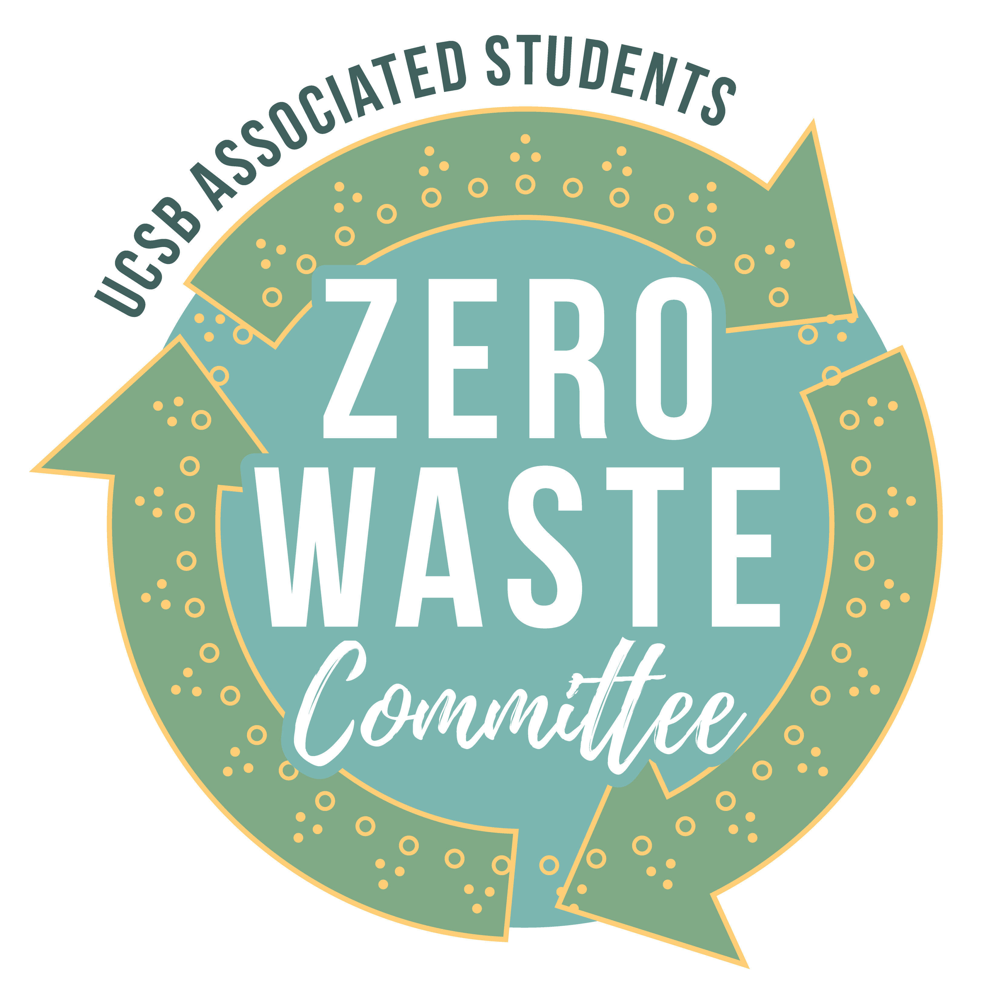
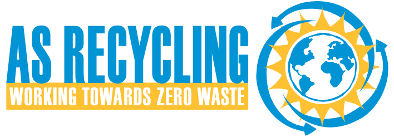
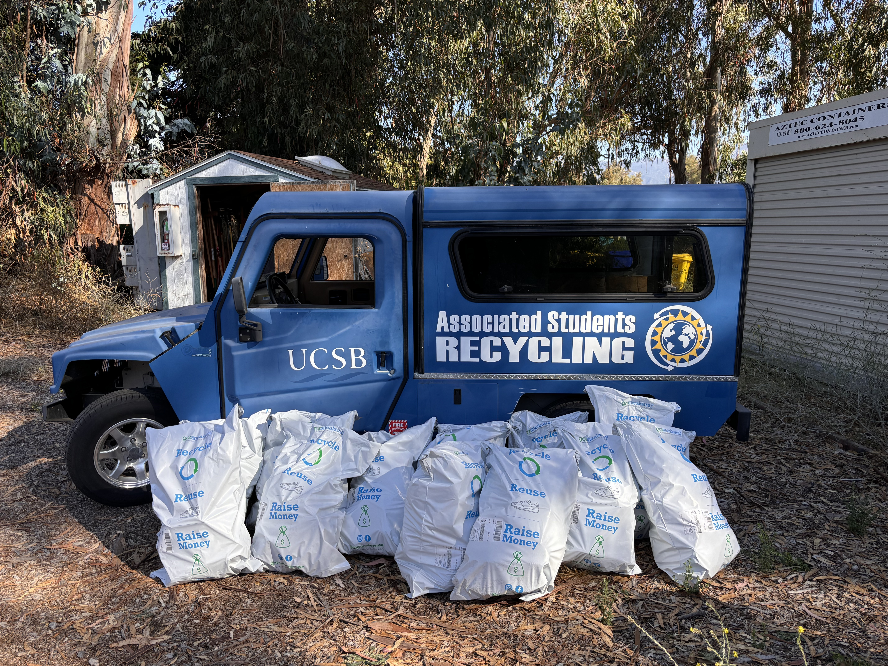

# Project Summary 

Founded in September, 2023 through the UC Santa Barbara's *Environmental Leadership Incubator (ELI)*, UCSB Shoe Recycling is the nation's first campus-wide shoe recycling program. It operates year-round with a main collection station located in the lobby of the campus Recreation Center and the Intercollegiate Athletics Center. 

During the final two weeks of Fall & Spring quarter, additional collection locations are staged within the lobbies of all on-campus housing. 

Since its inception, the program has collected over 2700 pairs of shoes, diverted 75,000+ lbs of $CO^2$, and saved over 5.65 millions gallons of water! 

# Why Shoes?

As a Track & Field athlete, it was normal for my peers and I to go through 2-3 pairs of sneakers annually. It always bothered me how once I was done with a pair, the only place for them to go was the trash. After doing some research, I found a program supported through a *very well known* shoe company who claimed anyone could recycle *any* type of shoe with them through their in-store take-back system. 

So... I started a collection of "dead shoes" in the trunk of my car and once I decided I was sick of hauling them around, I tried to drop them off at the shoe maker's local store. When I walked in with my shoes and asked where I should put them, the employees looked at me and blinked in confusion before telling me they had never heard of such a program and if one existed, their store didn't support it. 

I was confused but also frustrated. It begged the question: "How was a textile powerhouse like this going to market a program along with their products as sustainable yet not support a basic recycling program nationwide?" 

**Little did I know that this first-hand experience of green washing was the start of me going down a very long rabbit hole....***

In September 2023, I began taking part in the [Environmental Leadership Incubator](https://eli.ucsb.edu/), a year-long program run through UCSB's Environmental Studies department aimed at helping students develop critical leadership, project management, and communication skills while implementing a sustainability project. *This was my chance to address the at hand and make a change for the better.* 

I started researching footwear waste statistics as part of the "project validation" phase of ELI. Some of the facts I found were staggering...

- Americans throw away a staggering **300 million pairs* of sneakers annually**
- Footwear under the broader context of the textile industry, produces approximately **17 million tons of waste a year**
- Approximately **313 million metric tons** of carbon dioxide [is annually produced from the footwear industry], equivalent to the emissions from **66 million cars**

This was all the motivation I needed to make my vision for an increasingly circular world a reality. 

# Program Overview:

## How It Works

So what did I create?

Using bins located in the lobby of the UCSB Recreation Center, students, staff, faculty, & local residents are free to recycle their shoes in collection bins. 

The shoes are then collected, sorted, and shipped to [GotSneakers](https://gotsneakers.com/) in Miami, Florida.

Shoes in unusable condition get shipped to *Fast Feet Grinded* in the Netherlands where they're broken down and sorted into their constituent materials and sold to be reused in products ranging from carpet padding, insulation, and even field turf.

## Who Is Involved? 

::: {style="margin: 0 auto;"}
:::: {.grid}

::: {.g-col-12 .g-col-md-4 .d-flex .justify-content-center .align-items-center}
{width="80%"}
::: 

::: {.g-col-12 .g-col-md-4 .d-flex .justify-content-center .align-items-center}

::: 

::: {.g-col-12 .g-col-md-4 .d-flex .justify-content-center .align-items-center}

:::

::::
:::

::: {style="margin: 0 auto;"}

:::: {.grid}

::: {.g-col-12 .g-col-md-4}

**UCSB Zero Waste Committee**

*Responsibilities:*

- All forms of public outreach (on-campus and off-campus)

- Coordinating collection drive events 

:::

::: {.g-col-12 .g-col-md-4}

**AS Recycling**

*Responsibilities:*

- On-campus collection and storage of all shoes 

- Sorting & packaging of shoes

- Shipping shoes to GotSneakers via the on-campus post-office

:::

::: {.g-col-12 .g-col-md-4}

**GotSneakers LLC.**

*Responsibilities:*

- Supplying collection bins 

- Supplying shipping bags 

- Covering ALL COSTS associated with the program 

:::

::::

:::

# The Stats
{width="50%" fig-align="center"}

:::: {.grid}

::: {.g-col-12 .g-col-md-4 style="display:flex; flex-direction:column; justify-content:center; text-align:center;"}

[**2700+**]{style="font-size:150%;"}

Pairs of Shoes Collected 

:::

::: {.g-col-12 .g-col-md-4 style="display:flex; flex-direction:column; justify-content:center; text-align:center;"}

[**~75,000+**]{style="font-size:150%;"}

lbs of $CO^2$ diverted

:::

::: {.g-col-12 .g-col-md-4 style="display:flex; flex-direction:column; justify-content:center; text-align:center;"}

[**~5.70+**]{style="font-size:150%;"}

million gallons of water saved

:::

::::

::: {style="text-align: center;"}
[**Stats as of June 2, 2026**]{style="font-size:50%}
:::

# National Expansion 

In Winter of 2026, the program expanded nationally... 

## University of Vermont 

Elizabeth Opladen led the University of Vermont Zero Waste team to implement the first sister program to UCSB Shoe Recycling. So far, the program has been a success and has inspired the launch of additional recycling programs throughout the campus.

## Santa Barbara City College

Nelly Johanssen from Antioch University held a multi-week drive on the campus of Santa Barbara City College. Though she was only able to collect 22 pairs, she proved the replicability of the program is possible even with just a one-person team! 

# What's Next?

Beginning in June, 2026, the program will be expanding to Loudoun County Public Schools in Northern Virginia. The program will launch at Loudoun County Public High School with the vision of expanding across the district to **18 county high schools**.

